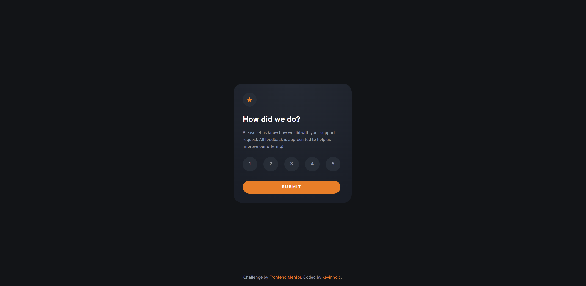

# Frontend Mentor - Interactive rating component solution

This is a solution to the [Interactive rating component challenge on Frontend Mentor](https://www.frontendmentor.io/challenges/interactive-rating-component-koxpeBUmI). Frontend Mentor challenges help you improve your coding skills by building realistic projects. 

## Table of contents

- [Overview](#overview)
  - [The challenge](#the-challenge)
  - [Screenshot](#screenshot)
  - [Links](#links)
- [Built with](#built-with)
- [Author](#author)

## Overview

### The challenge

Users should be able to:

- View the optimal layout for the app depending on their device's screen size
- See hover states for all interactive elements on the page
- Select and submit a number rating
- See the "Thank you" card state after submitting a rating

### Screenshot

### Links

- Solution URL: [View solution](https://www.frontendmentor.io/solutions/interactive-rating-component-with-parceljs-and-sass-B1ubfpKfc)
- Live Site URL: [Interactive Rating Component by kevinndlc](https://interactive-rating-component-main-lilac.vercel.app/)

## Built with

- Semantic HTML5 markup
- Flexbox
- Mobile-first workflow
- [Parcel](https://parceljs.org/) - Bundler
- [Sass](https://sass-lang.com/) - For styles

## Author

- Website - [Kevin Ndlc](https://www.kevinndlc.com)
- Frontend Mentor - [@kevinndlc](https://www.frontendmentor.io/profile/kevinndlc)
- Github - [@kevinndlc](https://github.com/kevinndlc)
